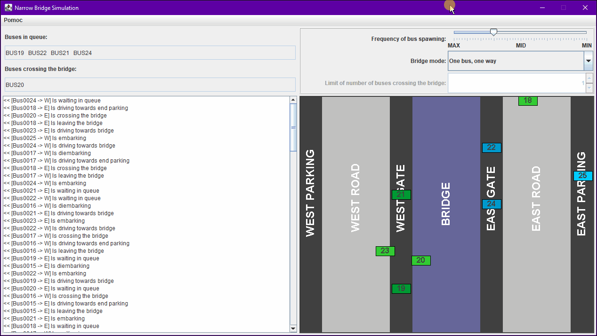
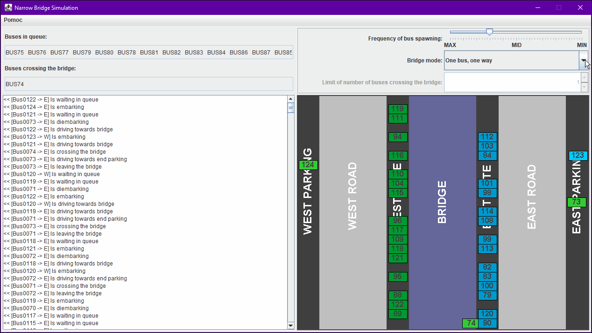

# Bridge Crossing Problem
> Visualization of Bridge Crossing Problem made with Java 1.8 and Swing library.

## Table of contents
- [Bridge Crossing Problem](#bridge-crossing-problem)
  - [Table of contents](#table-of-contents)
  - [General info](#general-info)
  - [Screenshots](#screenshots)
  - [Technologies](#technologies)
  - [Setup and run](#setup-and-run)
  - [Features](#features)
  - [Issues](#issues)
  - [Status](#status)
  - [Contact](#contact)

## General info
This program was created as an assigment for Java 1.8 course. Its main goal was to learn about multithreading programming architecture. [Bridge Crossing Problem](https://pages.mtu.edu/~shene/NSF-3/e-Book/MONITOR/Bridge/MON-example-bridge.html "Problem explanation") is a common multithreading problem.

## Screenshots

## Technologies
* Java 1.8 with Swing library.

## Setup and run
In order to run this project, Java 1.8 is required. Simply download this repository, add it to your Java IDE workspace and run it as Java Application (you can also build project to standalone application).

## Features
List of features:
* 4 different bridge modes: 
  * "One bus, one way" - only one bus crossing bridge at the time.
  * "Many buses, one way" - many buses crossing bridge at the time, but only in one direction. Bus limit might be changed in any time. Direction changes automatically every 10 seconds.
  * "Many buses, both ways" - same as for  "Many buses, one way", but buses are allowed to drive in both directions. 
  * "Unlimited" - unlimited crossing in both directions.
* Bridge limit control.
* Bus spawning frequency control.
* Visualization of simulation.
* List of buses in queue.
* List of buses on bridge.
* Logs.

## Issues
No major issues are known. However, if you would run simulation for long time enough, bus ID number (integer value) may overflow.

## Status
This project is finished and no longer developed.

## Contact
Created by [@michaltkacz](https://github.com/michaltkacz) - feel free to contact me!
